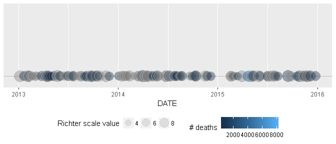
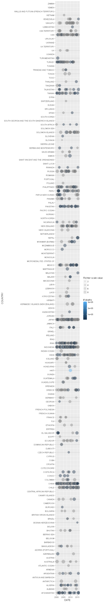
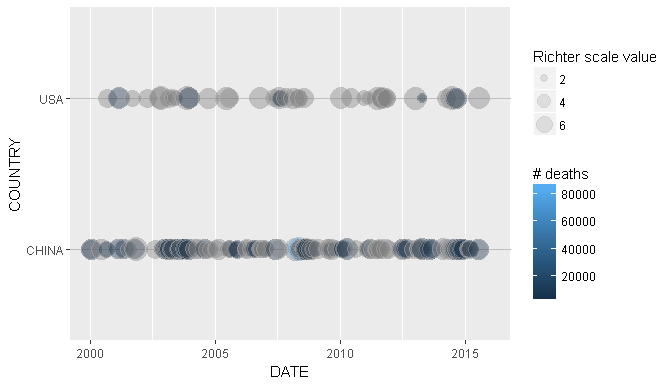
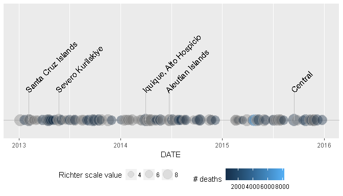
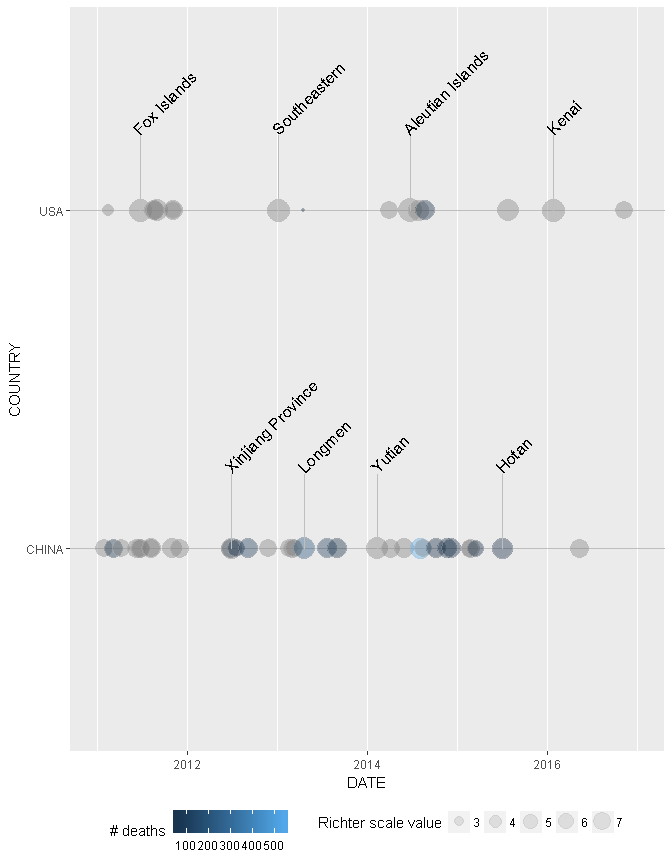

Eq
================
Scott Michael Dickson
2017-07-12

Eq package overview
===================

The Eq package contains a series of functions that enable the user to quickly load and visualise earthquake data.

The functions contained within this package are as follows:

-   eq\_read\_data
-   eq\_clean\_data
-   eq\_location\_clean
-   geom\_timeline
-   geom\_timeline\_label
-   eq\_map
-   eq\_create\_label

The following code can be used to install the package:

``` r
library(devtools)
install_github("drsmd23/Eq")
library(Eq)
```

eq\_read\_data
--------------

The eq\_read\_data function enables users to read earthquake data from the National Oceanographic and Atmospheric Administration (NOAA) text file. The input to the function is the path, name, and extension of the csv file containing the data. Only the name and extension are required if the file is stored in the current directory. The output is a data frame. The examples below use the data that is included with this package that can be accessed using the following code:

-   system.file("extdata", "signif.txt", package = "Eq").

Examples:

``` r
x <- system.file("extdata", "signif.txt", package = "Eq")
y <- eq_read_data(x)
#> Parsed with column specification:
#> cols(
#>   .default = col_integer(),
#>   FLAG_TSUNAMI = col_character(),
#>   SECOND = col_character(),
#>   EQ_PRIMARY = col_character(),
#>   EQ_MAG_MW = col_character(),
#>   EQ_MAG_MS = col_character(),
#>   EQ_MAG_MB = col_character(),
#>   EQ_MAG_ML = col_double(),
#>   EQ_MAG_MFA = col_character(),
#>   EQ_MAG_UNK = col_character(),
#>   COUNTRY = col_character(),
#>   STATE = col_character(),
#>   LOCATION_NAME = col_character(),
#>   LATITUDE = col_character(),
#>   LONGITUDE = col_character(),
#>   DEATHS = col_character(),
#>   MISSING = col_character(),
#>   INJURIES = col_character(),
#>   DAMAGE_MILLIONS_DOLLARS = col_character(),
#>   TOTAL_DEATHS = col_character(),
#>   TOTAL_MISSING = col_character()
#>   # ... with 2 more columns
#> )
#> See spec(...) for full column specifications.
y
#> # A tibble: 5,947 x 47
#>     I_D FLAG_TSUNAMI  YEAR MONTH   DAY  HOUR MINUTE SECOND FOCAL_DEPTH
#>   <int>        <chr> <int> <int> <int> <int>  <int>  <chr>       <int>
#> 1     1         <NA> -2150    NA    NA    NA     NA                 NA
#> 2     3         <NA> -2000    NA    NA    NA     NA   <NA>          18
#> 3     2          Tsu -2000    NA    NA    NA     NA   <NA>          NA
#> 4  5877          Tsu -1610    NA    NA    NA     NA   <NA>          NA
#> # ... with 5,943 more rows, and 38 more variables: EQ_PRIMARY <chr>,
#> #   EQ_MAG_MW <chr>, EQ_MAG_MS <chr>, EQ_MAG_MB <chr>, EQ_MAG_ML <dbl>,
#> #   EQ_MAG_MFA <chr>, EQ_MAG_UNK <chr>, INTENSITY <int>, COUNTRY <chr>,
#> #   STATE <chr>, LOCATION_NAME <chr>, LATITUDE <chr>, LONGITUDE <chr>,
#> #   REGION_CODE <int>, DEATHS <chr>, DEATHS_DESCRIPTION <int>,
#> #   MISSING <chr>, MISSING_DESCRIPTION <int>, INJURIES <chr>,
#> #   INJURIES_DESCRIPTION <int>, DAMAGE_MILLIONS_DOLLARS <chr>,
#> #   DAMAGE_DESCRIPTION <int>, HOUSES_DESTROYED <int>,
#> #   HOUSES_DESTROYED_DESCRIPTION <int>, HOUSES_DAMAGED <int>,
#> #   HOUSES_DAMAGED_DESCRIPTION <int>, TOTAL_DEATHS <chr>,
#> #   TOTAL_DEATHS_DESCRIPTION <int>, TOTAL_MISSING <chr>,
#> #   TOTAL_MISSING_DESCRIPTION <chr>, TOTAL_INJURIES <int>,
#> #   TOTAL_INJURIES_DESCRIPTION <int>, TOTAL_DAMAGE_MILLIONS_DOLLARS <chr>,
#> #   TOTAL_DAMAGE_DESCRIPTION <int>, TOTAL_HOUSES_DESTROYED <int>,
#> #   TOTAL_HOUSES_DESTROYED_DESCRIPTION <int>, TOTAL_HOUSES_DAMAGED <int>,
#> #   TOTAL_HOUSES_DAMAGED_DESCRIPTION <int>
```

eq\_clean\_data
---------------

The eq\_clean\_data function enables users to tidy and subset earthquake data. The columns that are kept in the data are: YEAR, MONTH, DAY, LATITUDE, LONGITUDE, LOCATION\_NAME, TOTAL\_DEATHS, COUNTRY, EQ\_PRIMARY. Records with negative year values are excluded. A date column is created from the YEAR, MONTH, and DAY columns. The input to the function is the name of the input data frame on which to apply the function. The output is a data frame.

#### Examples:

Code:

``` r
x <- system.file("extdata", "signif.txt", package = "Eq")
x <- eq_read_data(x)
y <- eq_clean_data(x)
y[,c("COUNTRY", "LATITUDE", "LONGITUDE", "DATE", "EQ_PRIMARY", "TOTAL_DEATHS", "LOCATION_NAME", "YEAR", "MONTH", "DAY")]
```

Result:

    #> # A tibble: 5,899 x 10
    #>        COUNTRY LATITUDE LONGITUDE       DATE EQ_PRIMARY TOTAL_DEATHS
    #>          <chr>    <dbl>     <dbl>     <date>      <dbl>        <dbl>
    #> 1 TURKMENISTAN    38.00      58.3 0010-01-01        7.1           NA
    #> 2       TURKEY    37.80      27.4 0011-01-01         NA           NA
    #> 3       TURKEY    37.85      27.3 0017-01-01         NA           NA
    #> 4       GREECE    38.20      22.2 0023-01-01         NA           NA
    #> # ... with 5,895 more rows, and 4 more variables: LOCATION_NAME <chr>,
    #> #   YEAR <int>, MONTH <dbl>, DAY <dbl>

eq\_location\_clean
-------------------

The eq\_location\_clean function enables users to tidy the LOCATION\_NAME field in the earthquake data. It is assumed that country names are followed by a colon when a subsequent city name is provided. Where only the country name is given in the LOCATION\_NAME field, the country name is removed since this information is in the country field. The LOCATION\_NAME field is converted to title case The input to the function is the name of the input data frame on which to apply the function. The output is a data frame.

#### Examples:

Code:

``` r
# Load either magrittr or dplyr package to allow use of pipe operator %>%
library(dplyr)
x <- system.file("extdata", "signif.txt", package = "Eq")
x <- x %>% 
eq_read_data() %>%
eq_clean_data()
y <- eq_location_clean(x)
y[,c("LOCATION_NAME")]
```

Result:

    #> # A tibble: 5,899 x 1
    #>                                LOCATION_NAME
    #>                                        <chr>
    #> 1                                       Nisa
    #> 2                                           
    #> 3 Izmir, Efes, Aydin, Manisa, Alasehir, Sart
    #> 4                                           
    #> # ... with 5,895 more rows

geom\_timeline
--------------

The geom\_timeline function enables users to plot a timeline of the earthquake data. Earthquakes between dates xmin and xmax are plotted. Separate timelines can be shown for different groups within a single plot e.g. using the COUNTRY field. The size of the points on the timeline can be set to distinguish earthquakes of differing magnitude e.g using the EQ\_PRIMARY field. The fill colour of the points on the timeline can be set to distinguish earthquakes of differing number of deaths e.g using the TOTAL\_DEATHS field.
The output is a timeline showing eathquake sizes and intensities between specified dates.

#### Examples:

Code:

``` r
# Single timeline of all earthquakes in date range from all countries

# Load either magrittr or dplyr package to allow use of pipe operator %>%
# Load ggplot2 package to allow use of ggplot function
library(dplyr)
library(ggplot2)
x1 <- system.file("extdata", "signif.txt", package = "Eq")
x1 <- x1 %>%
eq_read_data() %>%
eq_clean_data() %>%
eq_location_clean()
y1 <- ggplot(data = x1) +
geom_timeline(aes(  x = DATE,
                    xmin = as.Date("2013-01-01"),
                    xmax = as.Date("2015-12-31"),
                    size = EQ_PRIMARY,
                    fill = TOTAL_DEATHS                 
)) +
labs(size = "Richter scale value", fill = "# deaths") +
theme(legend.position="bottom")
y1
```

Result: 

Code:

``` r
# Separate timelines for earthquakes in each country

# Load either magrittr or dplyr package to allow use of pipe operator %>%
# Load ggplot2 package to allow use of ggplot function
library(dplyr)
library(ggplot2)
x2 <- system.file("extdata", "signif.txt", package = "Eq")
x2 <- x2 %>%
eq_read_data() %>%
eq_clean_data() %>%
eq_location_clean()
y2 <- ggplot(data = x2) +
geom_timeline(aes(  x = DATE,
                    xmin = as.Date("2000-01-01"),
                    xmax = as.Date("2015-12-31"),
                    y = COUNTRY,
                    size = EQ_PRIMARY,
                    fill = TOTAL_DEATHS                 
)) +
labs(size = "Richter scale value", fill = "# deaths") +
theme(legend.position="right")
y2
```

Result: 

Code:

``` r
# Separate timelines for earthquakes in selected countries

# Load either magrittr or dplyr package to allow use of pipe operator %>%
# Load ggplot2 package to allow use of ggplot function
library(dplyr)
library(ggplot2)
x3 <- system.file("extdata", "signif.txt", package = "Eq")
x3 <- x3 %>%
eq_read_data() %>%
eq_clean_data() %>%
eq_location_clean()
y3 <- ggplot(data = subset(x3, COUNTRY %in% c("USA" , "CHINA"))) +
geom_timeline(aes(  x = DATE,
                    xmin = as.Date("2000-01-01"),
                    xmax = as.Date("2015-12-31"),
                    y = COUNTRY,
                    size = EQ_PRIMARY,
                    fill = TOTAL_DEATHS                 
)) +
labs(size = "Richter scale value", fill = "# deaths") +
theme(legend.position="right")
y3
```

Result: 

geom\_timeline\_label
---------------------

The geom\_timeline\_label function enables users to add location labels to timeline plots of the earthquake data. Labels can be added to a subset of the plotted earthquakes using the n\_max parameter to show labels of the highest magnitude earthquakes. Parameters other than n\_max should be the same values as used in the geom\_timeline function.
The output is a timeline showing eathquake sizes and intensities between specified dates with location name labels.

#### Examples:

Code:

``` r
# Separate timelines for earthquakes in selected countries with labels for highest magnitude earthquakes only

# Load either magrittr or dplyr package to allow use of pipe operator %>%
# Load ggplot2 package to allow use of ggplot function
library(dplyr)
library(ggplot2)
x1 <- system.file("extdata", "signif.txt", package = "Eq")
x1 <- x1 %>%
eq_read_data() %>%
eq_clean_data() %>%
eq_location_clean()
y1 <- ggplot(data = x1) +
geom_timeline(aes(  x = DATE,
                    xmin = as.Date("2013-01-01"),
                    xmax = as.Date("2015-12-31"),
                    size = EQ_PRIMARY,
                    fill = TOTAL_DEATHS                 
)) + 
geom_timeline_label(aes(x = DATE,
                        xmin = as.Date("2013-01-01"),
                        xmax = as.Date("2015-12-31"), 
                        label = LOCATION_NAME, 
                        size = EQ_PRIMARY), 
                    n_max = 5) +
labs(size = "Richter scale value", fill = "# deaths") +
theme(legend.position="bottom")
y1
```

Result: 

Code:

``` r
# Separate timelines for earthquakes in selected countries with labels for highest magnitude earthquakes only

# Load either magrittr or dplyr package to allow use of pipe operator %>%
# Load ggplot2 package to allow use of ggplot function
library(dplyr)
library(ggplot2)
x3 <- system.file("extdata", "signif.txt", package = "Eq")
x3 <- x3 %>%
eq_read_data() %>%
eq_clean_data() %>%
eq_location_clean()
y3 <- ggplot(data = subset(x3, COUNTRY %in% c("USA" , "CHINA"))) +
geom_timeline(aes(  x = DATE,
                    xmin = as.Date("2011-01-01"),
                    xmax = as.Date("2016-12-31"),
                    y = COUNTRY,
                    size = EQ_PRIMARY,
                    fill = TOTAL_DEATHS                 
)) + 
geom_timeline_label(aes(x = DATE,
                        xmin = as.Date("2011-01-01"),
                        xmax = as.Date("2016-12-31"),
                        y = COUNTRY, 
                        label = LOCATION_NAME, 
                        size = EQ_PRIMARY), 
                    n_max = 4) +
labs(size = "Richter scale value", fill = "# deaths") +
theme(legend.position="bottom")
y3
```

Result: 

eq\_map
-------

The eq\_map function creates an interactive map of earthquake data. An input to the function is the name of the input data frame on which to apply the function. The annot\_col parameter can be used to specify the field to use as a label for points on the map e.g. DATE. The output is an interactive map.

#### Examples:

Code:

``` r
# Load either magrittr or dplyr package to allow use of pipe operator %>%
library(dplyr)
x <- system.file("extdata", "signif.txt", package = "Eq")
x <- x %>%
eq_read_data()
eq_clean_data()
eq_location_clean()
y <- x %>% 
dplyr::filter(COUNTRY == "MEXICO" & lubridate::year(DATE) >= 2000) %>% 
eq_map(annot_col = "DATE")
y
```

Result: <!--html_preserve-->

<script type="application/json" data-for="htmlwidget-6fdacc1b5758e03f6c02">{"x":{"options":{"crs":{"crsClass":"L.CRS.EPSG3857","code":null,"proj4def":null,"projectedBounds":null,"options":{}}},"calls":[{"method":"addProviderTiles","args":["Esri.WorldStreetMap",null,null,{"errorTileUrl":"","noWrap":false,"zIndex":null,"unloadInvisibleTiles":null,"updateWhenIdle":null,"detectRetina":false,"reuseTiles":false}]},{"method":"addCircleMarkers","args":[[18.194,32.319,16.87,18.77,17.488,26.319,17.302,32.456,32.437,32.297,16.396,17.844,16.493,16.917,17.552,17.385,14.742,17.842],[-95.908,-115.322,-100.113,-104.104,-101.303,-86.606,-100.198,-115.315,-115.165,-115.278,-97.782,-99.963,-98.231,-99.381,-100.816,-100.656,-92.409,-95.524],[5.9,5.5,5.3,7.5,6.1,5.8,6,5.1,5.9,7.2,6.2,6.4,7.4,6.2,7.2,6.4,6.9,6.3],null,null,{"lineCap":null,"lineJoin":null,"clickable":true,"pointerEvents":null,"className":"","stroke":true,"color":"#03F","weight":5,"opacity":0.5,"fill":true,"fillColor":"#03F","fillOpacity":0.4,"dashArray":null},null,null,["2002-01-30","2002-02-22","2002-09-25","2003-01-22","2004-01-01","2006-09-10","2007-04-13","2008-02-09","2009-12-30","2010-04-04","2010-06-30","2011-12-11","2012-03-20","2013-08-21","2014-04-18","2014-05-08","2014-07-07","2014-07-29"],null,null,null,null]}],"limits":{"lat":[14.742,32.456],"lng":[-115.322,-86.606]}},"evals":[],"jsHooks":[]}</script>
<!--/html_preserve-->
eq\_create\_label
-----------------

The eq\_create\_label function creates creates and applies formatting to the labels for the points on the interactive map of earthquake data. The input to the function is the name of the input data frame on which to apply the function.

#### Examples:

Code:

``` r
x <- system.file("extdata", "signif.txt", package = "Eq")
x <- x %>% 
eq_read_data()
eq_clean_data()
eq_location_clean()
y <- x %>% 
dplyr::filter(COUNTRY == "MEXICO" & lubridate::year(DATE) >= 2000) %>%
dplyr::mutate(popup_text = eq_create_label(.)) %>% 
eq_map(annot_col = "popup_text")
y
```

Result: <!--html_preserve-->

<script type="application/json" data-for="htmlwidget-6a1e2eaa71aa681eaf02">{"x":{"options":{"crs":{"crsClass":"L.CRS.EPSG3857","code":null,"proj4def":null,"projectedBounds":null,"options":{}}},"calls":[{"method":"addProviderTiles","args":["Esri.WorldStreetMap",null,null,{"errorTileUrl":"","noWrap":false,"zIndex":null,"unloadInvisibleTiles":null,"updateWhenIdle":null,"detectRetina":false,"reuseTiles":false}]},{"method":"addCircleMarkers","args":[[18.194,32.319,16.87,18.77,17.488,26.319,17.302,32.456,32.437,32.297,16.396,17.844,16.493,16.917,17.552,17.385,14.742,17.842],[-95.908,-115.322,-100.113,-104.104,-101.303,-86.606,-100.198,-115.315,-115.165,-115.278,-97.782,-99.963,-98.231,-99.381,-100.816,-100.656,-92.409,-95.524],[5.9,5.5,5.3,7.5,6.1,5.8,6,5.1,5.9,7.2,6.2,6.4,7.4,6.2,7.2,6.4,6.9,6.3],null,null,{"lineCap":null,"lineJoin":null,"clickable":true,"pointerEvents":null,"className":"","stroke":true,"color":"#03F","weight":5,"opacity":0.5,"fill":true,"fillColor":"#03F","fillOpacity":0.4,"dashArray":null},null,null,["<b>Location:<\/b> San Andres Tuxtla, Tuxtepec <br /> <b>Magnitude:<\/b> 5.9 <br /> ","<b>Location:<\/b> Mexicali, Baja California <br /> <b>Magnitude:<\/b> 5.5 <br /> ","<b>Location:<\/b> Acapulco <br /> <b>Magnitude:<\/b> 5.3 <br /> ","<b>Location:<\/b> Villa De Alvarez, Colima, Tecoman, Jalisco <br /> <b>Magnitude:<\/b> 7.5 <br /> <b>Total deaths:<\/b> 29 <br />","<b>Location:<\/b> Guerrero, Mexico City <br /> <b>Magnitude:<\/b> 6.1 <br /> "," <b>Magnitude:<\/b> 5.8 <br /> ","<b>Location:<\/b> Guerrero, Atoyac <br /> <b>Magnitude:<\/b> 6 <br /> ","<b>Location:<\/b> Baja California <br /> <b>Magnitude:<\/b> 5.1 <br /> ","<b>Location:<\/b> Mexicali <br /> <b>Magnitude:<\/b> 5.9 <br /> ","<b>Location:<\/b> Baja California <br /> <b>Magnitude:<\/b> 7.2 <br /> <b>Total deaths:<\/b> 2 <br />","<b>Location:<\/b> San Andres Huaxpaltepec <br /> <b>Magnitude:<\/b> 6.2 <br /> <b>Total deaths:<\/b> 1 <br />","<b>Location:<\/b> Guerrero <br /> <b>Magnitude:<\/b> 6.4 <br /> <b>Total deaths:<\/b> 2 <br />","<b>Location:<\/b> Guerrero, Oaxaca <br /> <b>Magnitude:<\/b> 7.4 <br /> <b>Total deaths:<\/b> 2 <br />","<b>Location:<\/b> Acapulco <br /> <b>Magnitude:<\/b> 6.2 <br /> ","<b>Location:<\/b> Guerrero; Mexico City <br /> <b>Magnitude:<\/b> 7.2 <br /> ","<b>Location:<\/b> Tecpan <br /> <b>Magnitude:<\/b> 6.4 <br /> ","<b>Location:<\/b> San Marcos <br /> <b>Magnitude:<\/b> 6.9 <br /> <b>Total deaths:<\/b> 3 <br />","<b>Location:<\/b> Oaxaca <br /> <b>Magnitude:<\/b> 6.3 <br /> <b>Total deaths:<\/b> 1 <br />"],null,null,null,null]}],"limits":{"lat":[14.742,32.456],"lng":[-115.322,-86.606]}},"evals":[],"jsHooks":[]}</script>
<!--/html_preserve-->
